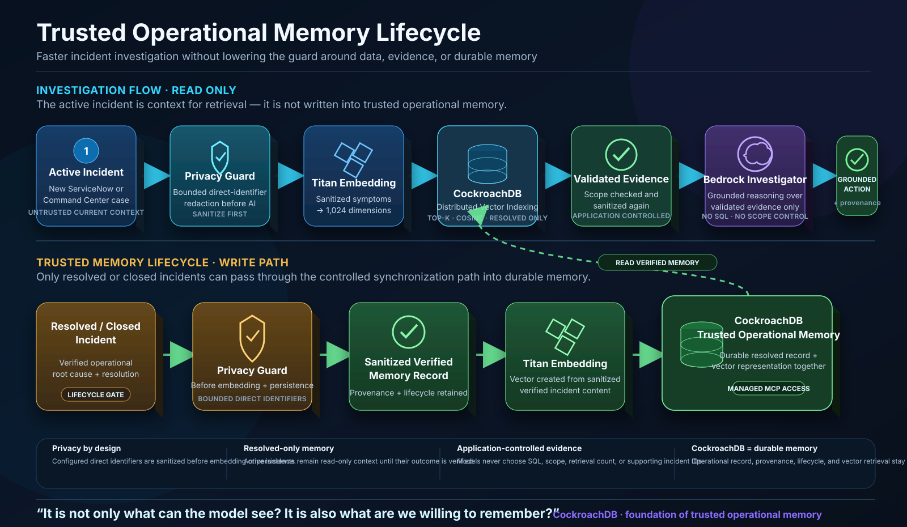
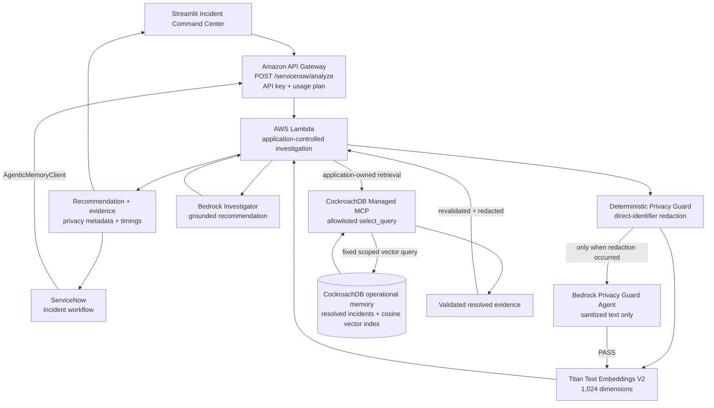

# Agentic Incident Memory

> Operational memory for incident response — retrieve how similar failures were actually resolved,
> protect sensitive incident context, and generate the next recommendation from validated evidence.

[](https://agentic-incident-command-center.streamlit.app)


[](https://github.com/robert-lukowski/cockroach-agentic-memory/actions/workflows/ci.yml)
[](https://github.com/robert-lukowski/cockroach-agentic-memory/actions/workflows/generate-demo-incident.yml)

Agentic Incident Memory turns resolved incidents into searchable operational memory. CockroachDB
stores normalized incident embeddings and retrieves semantically similar historical evidence;
Amazon Bedrock generates a diagnosis and recommended actions grounded in those verified root causes
and resolutions. A separate Privacy Guard boundary removes configured direct identifiers before
vector or generative processing and can ask a second Bedrock agent to validate only the already
sanitized payload.

Operators receive the result through the ServiceNow incident workflow or the public Streamlit
Incident Command Center.

### [Launch Incident Command Center](https://agentic-incident-command-center.streamlit.app)

## Why Agentic Incident Memory?

Incident teams repeatedly solve similar failures, but the useful knowledge is fragmented across
ticket history. Operators must rediscover the same causes, diagnostics, and remediations while an
active outage is already consuming time. At the same time, incident descriptions can contain direct
identifiers that should not become durable AI memory or be forwarded unchanged into model context.

The application follows a controlled path:

**Active incident** → **Privacy Guard** → **Titan embedding** → **CockroachDB operational memory** →
**validated resolved evidence** → **Bedrock Investigator** → **recommendation + provenance**

CockroachDB is the durable retrieval layer, not just a log store. Application code owns scope,
retrieval, validation, privacy redaction, and evidence selection. Models never choose SQL, memory
scope, or supporting incident IDs.

## Trusted operational memory lifecycle

The system separates **read-only investigation** from the **trusted-memory write lifecycle**. An
active incident can retrieve historical evidence, but it cannot become durable memory merely because
a model produced a plausible hypothesis. Only resolved or closed incidents enter the controlled
synchronization path, where configured direct identifiers are sanitized before embedding generation
and persistence.

<p align="center">
  
</p>

### Why CockroachDB matters to the architecture

CockroachDB is deliberately more than a vector-search accessory in this project. It is the durable
system of record for **trusted operational memory**: the verified incident record, provenance,
lifecycle context, and semantic vector representation remain part of one consistent memory model.
Distributed Vector Indexing then retrieves the most relevant verified resolutions for the next
incident, while CockroachDB Cloud Managed MCP provides the constrained application-owned access path.

That design keeps deterministic controls around probabilistic AI. The application decides what may
be remembered, what scope may be searched, how many memories may be returned, and which records
become evidence. The model reasons over validated evidence; it does not become the database control
plane.

## Current proof points

| Project evidence | Current value |
| --- | ---: |
| Synthetic ServiceNow incidents in the reviewed corpus | **60** |
| Resolved incidents synchronized as operational memory | **50** |
| Active scenarios retained for investigation | **10** |
| Supporting resolved incidents per ServiceNow investigation | **Up to 5** |
| Automated tests | **256 passing** |
| Test coverage | **91.95%** |
| Static AWS access keys required by GitHub → AWS OIDC automation | **0** |

## Architecture



The Privacy Guard reviewer is intentionally narrower than the Investigator. It cannot access
CockroachDB, select scope, choose SQL, write memory, or reconstruct removed values. It sees only the
sanitized current-incident text and returns `PASS` or `REVIEW_REQUIRED`.

See [`docs/architecture.md`](docs/architecture.md) for the detailed trust boundaries and explicit
limitations.

## Privacy Guard: second agent with separation of duties

The project does not send raw detected identifiers to an LLM and then ask that same LLM to redact
them. The boundary is deliberately split:

1. Deterministic application code removes configured direct identifiers first.
2. Email addresses and explicitly labeled phone/name fields are replaced with fixed placeholders.
3. If redaction occurred, a secondary Bedrock Privacy Guard agent receives **only sanitized text**.
4. `PASS` releases the sanitized request to the normal embedding/retrieval workflow.
5. `REVIEW_REQUIRED` stops the request before embedding or Investigator generation.
6. If the optional audit call is unavailable, deterministic redaction remains enforced and the
   response reports the degraded audit state without reintroducing removed values.
7. Retrieved historical evidence is redacted again before it reaches the Investigator or API
   projection.
8. New resolved-memory ingestion applies deterministic redaction before embedding and persistence.

The response exposes only safe metadata such as redaction count, category names, audit status, and
whether the secondary AI review ran. Removed values are not echoed in the result payload or Privacy
Guard result card.

This is intentionally described as a **bounded direct-identifier control**, not as universal PII,
PHI, DLP, or regulatory-compliance detection.

## How an investigation works

1. An operator submits or opens an active incident.
2. Privacy Guard sanitizes the current incident before vector or generative AI processing.
3. Titan converts the sanitized symptoms into a normalized 1,024-dimensional embedding.
4. CockroachDB retrieves semantically similar resolved memories within the application-owned scope.
5. Application code validates and sanitizes the retrieved evidence.
6. Bedrock Investigator receives only controlled current symptoms and validated historical evidence.
7. Bedrock generates a concise diagnosis and numbered recommended actions.
8. The API returns the recommendation, repository-derived supporting incidents, privacy metadata,
   and real per-request timings.

Analysis is read-only with respect to operational memory. An active incident becomes historical
memory only after it has been resolved and passed through the explicit synchronization workflow.

## Incident Command Center

The Streamlit application calls the API rather than connecting directly to Bedrock, CockroachDB,
Managed MCP, AWS credentials, or ServiceNow. It supports:

- custom incident input and reviewed synthetic scenarios;
- a dedicated **Privacy Guard — incident with synthetic personal data** scenario;
- visible Privacy Guard result metadata after an investigation;
- real **Execution Telemetry** for Privacy Guard, vector retrieval, Bedrock inference, and backend
  request processing when those timings are returned;
- semantic match score, supporting-incident count, and client-observed round trip;
- complete grounded recommendation text and structured supporting-incident cards;
- an Operational Memory Graph with readable incident-number and service labels;
- root-cause, resolution, and similarity detail for retrieved historical memories;
- a static Verified Security Controls scorecard, clearly separated from live telemetry;
- a high-entropy judge access gate for live cloud-backed investigations while keeping the UI
  browseable;
- exactly one safe automatic retry after a transient HTTP `502` or `503`;
- sanitized configuration, transport, and response errors.

### [Open the live Incident Command Center](https://agentic-incident-command-center.streamlit.app)

## Judge-friendly Privacy Guard demo

From the Command Center choose:

**Privacy Guard — incident with synthetic personal data**

The reviewed fictional input contains a synthetic name, email address, and phone number. After the
request completes, the result should show that direct identifiers were intercepted before embeddings
and Investigator generation, while the recommendation and supporting operational-memory evidence
remain available.

The same concept can be demonstrated end-to-end in ServiceNow. The GitHub workflow supports a manual
`privacy-guard` scenario that creates one active synthetic ServiceNow incident using the existing
OIDC → Secrets Manager → ServiceNow automation. After creation, use the existing **Analyze with
Agentic Memory** action in ServiceNow. No Streamlit judge access code or additional ServiceNow
permission is required for the analysis path.

## ServiceNow integration

The scoped application keeps investigation inside the operator's existing workflow:

**ServiceNow Incident** → **Analyze with Agentic Memory** → **`AgenticMemoryClient`** →
**`POST /servicenow/analyze`** → **Privacy Guard** → **grounded recommendation + structured
supporting incidents** → **readable `work_notes`**

The API still accepts the same fixed 12-field request contract. It applies the deployment-owned
memory scope and `top_k=5`; callers cannot select scope, filters, retrieval count, MCP tool, or SQL.
Privacy metadata and timings are additive response fields, so the existing ServiceNow analysis path
is not gated by Streamlit state or a judge access code.

The scoped application source is maintained separately in
[`agentic-incident-memory-servicenow`](https://github.com/robert-lukowski/agentic-incident-memory-servicenow).

## Security & production-readiness

Concrete controls include:

- deterministic privacy redaction before configured direct identifiers reach embeddings or the
  Investigator;
- a secondary Bedrock Privacy Guard reviewer that receives sanitized text only;
- GitHub Actions OIDC + AWS STS temporary credentials, with no static AWS access key in automation;
- integration credentials outside source code in AWS Secrets Manager;
- Lambda IAM scoped to reviewed Bedrock model and secret resources;
- API Gateway `AWS_IAM` by default, with the ServiceNow route as the reviewed API-key exception;
- Managed MCP operations allowlisted to constrained application-owned operations;
- fixed application-owned vector query construction and exact required scope filtering;
- strict request shape, type, size, length, vector-dimension, and evidence validation;
- no model-supplied SQL, scope, retrieval count, or supporting IDs;
- sanitized logs and frontend errors that do not echo request bodies, credentials, provider
  responses, SQL, or model output;
- API usage-plan throttling/quota for the ServiceNow route;
- high-entropy access-code protection for public live demo execution;
- one bounded frontend retry for transient `502`/`503` failures;
- CI running Ruff and the full pytest suite on pull requests.

The Verified Security Controls panel is an architecture view rather than live security telemetry.

## Technology stack

| Area | Technologies |
| --- | --- |
| Frontend | Streamlit, Plotly |
| Incident management | ServiceNow scoped application, UI Action, REST Message |
| Compute and API | AWS Lambda, Amazon API Gateway, AWS SAM |
| AI | Amazon Bedrock, Titan Text Embeddings V2, Bedrock Investigator + Privacy Guard reviewer |
| Operational memory | CockroachDB Basic, cosine vector similarity, CockroachDB Cloud Managed MCP |
| Security and automation | GitHub Actions, GitHub OIDC, AWS IAM/STS, AWS Secrets Manager |
| Engineering | Python 3.13, pytest, coverage.py, Ruff |

## Current GitHub automation

The scheduled demo workflow runs every six hours using the existing random active demo scenario and
also supports manual dispatch:

**GitHub Actions** → **GitHub OIDC** → **temporary AWS role** → **Secrets Manager** → **ServiceNow**

Manual dispatch exposes the reviewed `privacy-guard` option. The workflow does not accept arbitrary
incident content from the caller. The OIDC role can read exactly the configured ServiceNow secret;
it is not a general AWS deployment role.

See [`docs/scheduled-demo-incidents.md`](docs/scheduled-demo-incidents.md).

## Operational-memory ingestion and source idempotency

Source-aware ingestion accepts a validated `source_id` and derives a deterministic incident UUID.
The service performs a fixed primary-key lookup and returns:

- `201` / `created` for a new operational memory;
- `200` / `already_present` when reviewed sanitized fields match;
- `200` / `updated` when the same source contains reviewed changes.

`verify_only=true` performs lookup/comparison without embedding or writing. Callers cannot supply an
incident UUID, SQL, MCP tool name, or database operation.

The forward-only migration is [`db/migrations/001_incident_memories.sql`](db/migrations/001_incident_memories.sql).
Demo loading is documented in [`docs/demo-data-loading.md`](docs/demo-data-loading.md) and
[`docs/demo-dataset.md`](docs/demo-dataset.md).

## API routes

`GET /health`, `POST /incidents`, and `POST /investigations` require AWS Signature Version 4 for the
`execute-api` service.

`POST /servicenow/analyze` is the reviewed exception. It requires the dedicated API Gateway key in
`x-api-key`, is attached to the development usage plan, rejects bodies over 32 KiB, and applies its
own memory scope and fixed `top_k=5`.

`GET /health` returns process/configuration status only and does not expose model IDs, cluster IDs,
secret identifiers, API keys, environment contents, or credential state.

## Local development and validation

Prerequisites are Python 3.13 and AWS SAM CLI. Unit tests use deterministic local fakes and do not
make network calls.

```powershell
python -m venv .venv
.venv\Scripts\python -m pip install -r requirements-dev.txt
.venv\Scripts\python -m pip install -r src\requirements.txt
.venv\Scripts\python -m pip install -r frontend\requirements.txt
.venv\Scripts\python -m ruff check .
.venv\Scripts\python -m pytest
sam validate --lint --region eu-central-1
sam build
git diff --check
```

Run the frontend locally with:

```powershell
.venv\Scripts\python -m streamlit run frontend\app.py
```

Frontend configuration is documented in [`frontend/README.md`](frontend/README.md). Never commit a
populated `.streamlit/secrets.toml`.

## AWS development deployment

The development deployment uses region `eu-central-1` and stack name
`cockroach-agentic-memory-dev`. The existing GitHub OIDC role is intentionally limited to the
ServiceNow demo workflow, so backend application changes are deployed through the reviewed SAM
deployment path rather than giving CI broad CloudFormation permissions.

```powershell
sam build
sam deploy `
  --stack-name cockroach-agentic-memory-dev `
  --profile cockroach-hackathon-dev `
  --region eu-central-1 `
  --capabilities CAPABILITY_NAMED_IAM `
  --resolve-s3 `
  --parameter-overrides `
    EnvironmentName=dev `
    McpSecretArn=<secret-arn> `
    CockroachClusterId=<cluster-uuid> `
    CockroachDatabase=defaultdb `
    ServiceNowMemoryScope=servicenow-dev
```

Do not commit resolved parameter values. A deployment is complete only after the IAM-signed routes
and API-key-protected ServiceNow route pass smoke tests.

## Known limitations

- Direct-identifier redaction currently covers email addresses and explicitly labeled phone/name
  fields; it is not a universal PII/PHI/DLP engine.
- The secondary Privacy Guard agent is defense in depth. Deterministic redaction is the boundary that
  prevents configured raw identifiers from reaching that reviewer or the Investigator.
- CockroachDB Basic is a single-region development cluster, not a production availability design.
- Managed MCP is an external dependency and its cached service-account credential requires a
  reviewed rotation strategy.
- API Gateway usage-plan throttles and quotas are best-effort development controls, not hard security
  or cost boundaries.
- The ServiceNow integration uses an API key rather than OAuth or mTLS.
- Tenant separation is a validated scope convention, not a complete production authorization
  policy.
- Bedrock output remains probabilistic even though generation is constrained by validated evidence.
- The current MVP does not implement a model-directed tool loop or autonomous production changes.

## Roadmap

The current implementation stops at evidence-grounded, privacy-protected investigation. A future
closed-loop path could extend it with real pipeline-failure intake, read-only GitHub log retrieval,
human-approved remediation proposals, pull-request creation, CI validation, and resolved-incident
learning.

Those roadmap items are not represented as implemented capabilities.

## License

MIT — see [`LICENSE`](LICENSE).