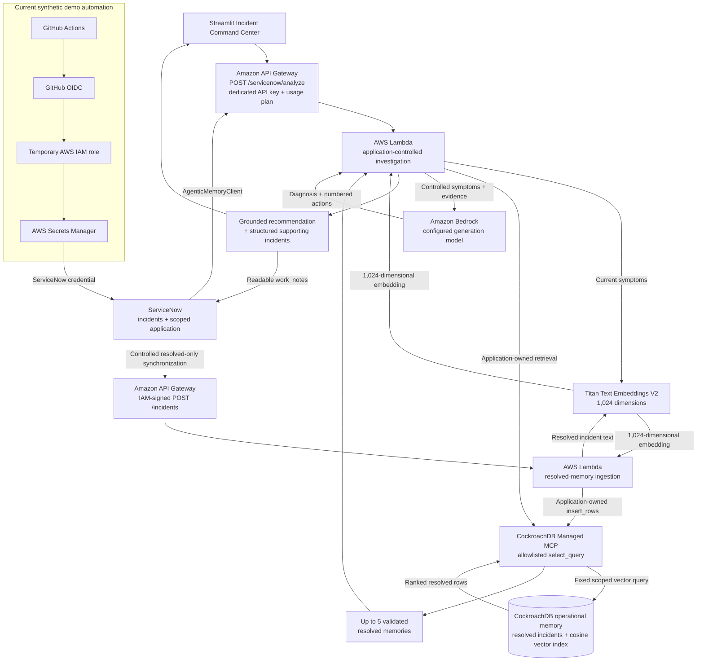
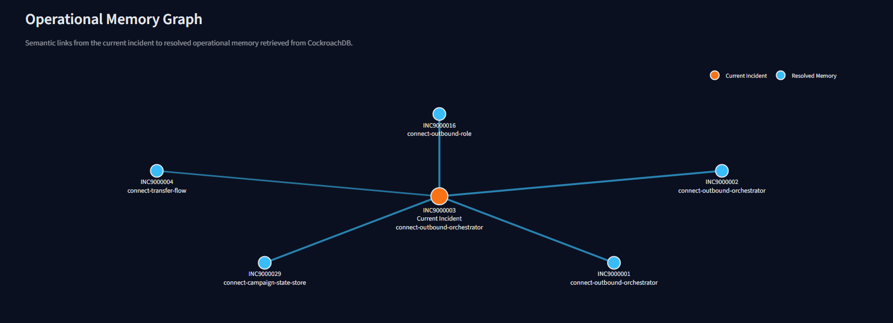
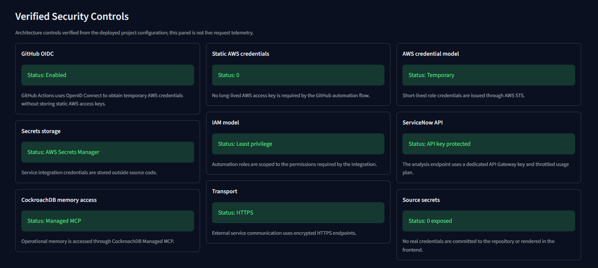
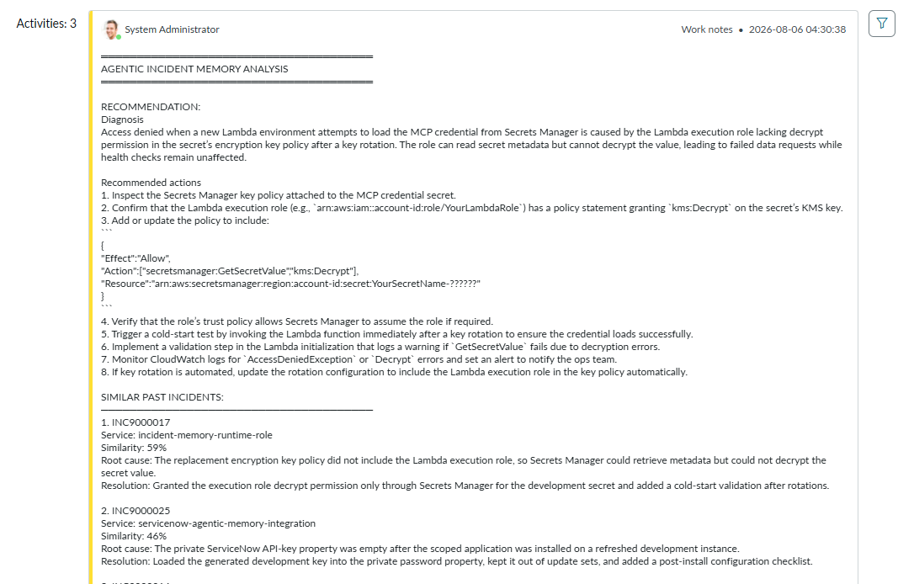

# Agentic Incident Memory

> Operational memory for incident response — retrieve how similar failures were actually resolved
> before generating the next recommendation.

[](https://agentic-incident-command-center.streamlit.app)


[](https://github.com/robert-lukowski/cockroach-agentic-memory/actions/workflows/generate-demo-incident.yml)

Agentic Incident Memory turns resolved incidents into searchable operational memory. CockroachDB
stores normalized incident embeddings and retrieves semantically similar historical evidence;
Amazon Bedrock then generates a diagnosis and recommended actions grounded in those verified root
causes and resolutions. Operators receive the result through the ServiceNow incident workflow or
the public Streamlit Incident Command Center.

### [Launch Incident Command Center](https://agentic-incident-command-center.streamlit.app)

## Why Agentic Incident Memory?

Incident teams repeatedly solve similar failures, but the useful knowledge is fragmented across
ticket history. Operators must rediscover the same causes, diagnostics, and remediations while an
active outage is already consuming time.

Agentic Incident Memory follows a controlled retrieval-first path:

**New active incident** → **semantically related resolved incidents** → **verified root causes and
resolutions** → **Bedrock grounded recommendation** → **recommendation and evidence for the
operator**

CockroachDB is the durable retrieval layer, not just a log store. The application owns scope,
retrieval, validation, and evidence selection; Bedrock receives only the current symptoms and the
validated historical evidence.

## Current proof points

| Project evidence | Current value |
| --- | ---: |
| Synthetic ServiceNow incidents | **60** |
| Resolved incidents synchronized as operational memory | **50** |
| Active incidents retained for investigation | **10** |
| Supporting resolved incidents per ServiceNow investigation | **Up to 5** |
| Automated tests | **225 passing** |
| Test coverage | **92.12%** |
| Static AWS access keys required by the GitHub → AWS OIDC automation flow | **0** |

## Architecture



The model never accesses CockroachDB directly, chooses SQL, selects a memory scope, or decides which
incident IDs the application returns. GitHub OIDC applies only to the synthetic automation path; it
does not authenticate Streamlit or ServiceNow analysis requests. See
[`docs/architecture.md`](docs/architecture.md) for the detailed trust boundaries.

## How an investigation works

1. An operator submits or opens an active incident.
2. The application converts its symptoms into a normalized Titan embedding.
3. CockroachDB retrieves semantically similar resolved memories within the application-owned scope.
4. The application validates and projects the retrieved evidence into a fixed safe structure.
5. Bedrock receives only controlled current symptoms and the validated evidence.
6. Bedrock generates a concise diagnosis and numbered recommended actions.
7. The UI displays the recommendation, semantic matches, historical root causes, and resolutions.

Analysis is read-only with respect to operational memory. An active incident becomes historical
memory only after it has been resolved and passed through the explicit synchronization workflow.

## Incident Command Center

The deployed Streamlit application provides a focused investigation surface without connecting
directly to Bedrock, CockroachDB, Managed MCP, AWS credentials, or ServiceNow. It calls the existing
API-key-protected analysis endpoint and supports:

- custom incident input and a synthetic sample-incident loader;
- semantic match score, supporting-incident count, and client-observed latency;
- complete grounded recommendation text and rich supporting-incident cards;
- an Operational Memory Graph with readable incident-number and service labels;
- root-cause, resolution, and similarity detail for retrieved historical memories;
- a static Verified Security Controls scorecard, clearly separated from live telemetry;
- exactly one safe automatic retry after a transient HTTP `502` or `503`;
- sanitized configuration, transport, and response errors.

### [Open the live Incident Command Center](https://agentic-incident-command-center.streamlit.app)

## Product showcase

### Operational Memory Graph

The current incident sits at the center of a compact star visualization, connected to resolved
operational memories returned by CockroachDB semantic retrieval. Labels expose the available
incident number and service without inventing relationships between historical incidents.

[](docs/assets/operational-memory-graph.png)

### Verified Security Controls

The frontend summarizes repository-verified architectural guardrails such as GitHub OIDC, temporary
AWS credentials, Secrets Manager, least-privilege IAM, Managed MCP, and HTTPS. The scorecard is an
architecture view rather than live request telemetry.

[](docs/assets/security-controls.png)

### ServiceNow analysis in work notes

The ServiceNow UI Action brings the grounded recommendation and readable supporting incidents back
into the operator's existing workflow. The resulting work notes preserve incident numbers, services,
similarity, historical root causes, and resolutions for practical follow-up.

[](docs/assets/servicenow-work-notes.png)

## ServiceNow integration

The scoped ServiceNow application keeps investigation inside the operator's existing workflow:

**ServiceNow Incident** → **Analyze with Agentic Memory UI Action** → **`AgenticMemoryClient`** →
**`POST /servicenow/analyze`** → **grounded recommendation + structured supporting incidents** →
**readable `work_notes`**

Structured evidence includes the preferred ServiceNow `incident_number` (with the technical UUID
used only as a fallback), service, similarity, root cause, and resolution. Analysis never stores the
active incident as historical evidence. The field-level contract and authentication boundary are
documented in [`docs/servicenow-integration.md`](docs/servicenow-integration.md); the scoped
application source is maintained in the separate
[`agentic-incident-memory-servicenow`](https://github.com/robert-lukowski/agentic-incident-memory-servicenow)
repository.

## Security & production-readiness

The project implements concrete architectural controls while keeping their status distinct from
live request telemetry:

- GitHub Actions uses GitHub OIDC and AWS STS temporary role credentials; that automation flow
  requires no static AWS access keys.
- Integration credentials remain outside source code in AWS Secrets Manager.
- Lambda and automation IAM policies are scoped to reviewed model and secret resources.
- API Gateway keeps `AWS_IAM` as the default authorizer; the ServiceNow route uses a dedicated API
  key with a throttled, quota-controlled usage plan.
- External service endpoints use HTTPS, and the frontend rejects credential-bearing or non-HTTPS
  endpoint configuration.
- Managed MCP operations are allowlisted; the repository exposes constrained application-owned
  operations rather than unrestricted data access.
- Request shape, size, types, lengths, vector dimensions, scope, and retrieved evidence are strictly
  validated.
- Callers and models cannot supply SQL, choose scope for ServiceNow analysis, or select returned
  incident IDs.
- Logs and frontend errors redact request bodies, descriptions, credentials, provider payloads, SQL,
  and model responses.
- The frontend retries exactly once, and only after HTTP `502` or `503`; the client-observed latency
  includes that retry delay without fabricating backend timing.

These are design and configuration controls, not a real-time audit feed. See
[`docs/architecture.md`](docs/architecture.md) for limitations and deeper trust-boundary detail.

## Technology stack

| Area | Technologies |
| --- | --- |
| Frontend | Streamlit, Plotly |
| Incident management | ServiceNow scoped application, UI Action, REST Message |
| Compute and API | AWS Lambda, Amazon API Gateway, AWS SAM |
| AI | Amazon Bedrock, Titan Text Embeddings V2, configured Bedrock generation model |
| Operational memory | CockroachDB Basic, cosine vector similarity search, CockroachDB Cloud Managed MCP |
| Security and automation | GitHub Actions, GitHub OIDC, AWS IAM/STS, AWS Secrets Manager |
| Engineering | Python 3.13, pytest, coverage.py, Ruff |

## Try it

Use the built-in **Amazon Connect outbound call failure** sample or submit an equivalent fictional
active incident:

```text
Short description: Amazon Connect outbound calls fail after Lambda deployment
Symptoms: The contact flow starts and Lambda completes, but the outbound call is not established.
          Intermittent timeouts began after deployment; a manual retry sometimes succeeds.
Service: connect-outbound-orchestrator
```

The result should contain semantic matches, resolved supporting incidents, an evidence-backed
recommendation, and the Operational Memory Graph. Retrieval scores can change as operational memory
evolves, so the demo does not depend on a hard-coded similarity value.

### [Try the live demo](https://agentic-incident-command-center.streamlit.app)

## Current GitHub automation

The implemented [scheduled demo workflow](.github/workflows/generate-demo-incident.yml) runs every
six hours and supports manual dispatch:

**GitHub Actions** → **GitHub OIDC** → **temporary AWS role** → **retrieve the ServiceNow credential
from Secrets Manager** → **create one synthetic active ServiceNow incident**

This is synthetic workload generation for the hackathon demonstration. It does **not** claim that a
real failed production pipeline automatically opens an incident. Configuration and safety details
are in [`docs/scheduled-demo-incidents.md`](docs/scheduled-demo-incidents.md).

## Roadmap: closed-loop incident response

The current implementation stops at evidence-grounded investigation. A future closed-loop flow
could extend it as follows:

**Real GitHub pipeline failure** → **automated failure intake** → **ServiceNow incident** →
**Agentic Incident Memory investigation** → **GitHub logs/context retrieval** → **proposed
remediation** → **human approval** → **branch / commit / PR** → **CI validation** → **resolved
incident becomes new operational memory**

Potential future work:

- a failure-driven reusable workflow and GitHub App with read-only job-log access;
- patch proposals, explicit human approval, and automated pull-request creation;
- a larger historical dataset and richer operational telemetry;
- a before-vs-memory-grounded recommendation comparison;
- production-grade identity, tenant policy, resilience, and multi-region design.

None of these roadmap items are represented as implemented capabilities.

## Engineering reference

<details>
<summary><strong>API routes and authentication</strong></summary>

`GET /health`, `POST /incidents`, and `POST /investigations` require AWS Signature Version 4 for the
`execute-api` service. `POST /servicenow/analyze` is the only exception: it requires a dedicated API
Gateway key in `x-api-key` and is attached to the development usage plan.

### `POST /incidents`

Validates a resolved incident, creates a 1,024-dimensional embedding, and stores it through the
constrained repository interface. Required fields are `scope`, `service`, `environment`, `title`,
`symptoms`, `root_cause`, and `resolution`; optional fields are `tags`, `metadata`, and the
source-aware controls described below. Unknown fields are rejected. See
[`events/create-incident.json`](events/create-incident.json).

### `POST /investigations`

Embeds submitted symptoms, retrieves the requested bounded number of incidents in the exact scope,
and gives the validated evidence to Bedrock. Application code—not model output—copies
`supporting_incident_ids` and projects `supporting_incidents` with incident number, service,
similarity, root cause, and resolution. See [`events/investigate.json`](events/investigate.json).

### `POST /servicenow/analyze`

Accepts the fixed 12-field payload emitted by `AgenticMemoryClient`. The server applies its own
memory scope and `top_k=5`; callers cannot select scope, filters, retrieval count, tool, or query.
The request is limited to 32 KiB and strictly validated. Recommendation text is concise plain text,
while structured supporting evidence remains application-owned. See
[`events/servicenow-analyze.json`](events/servicenow-analyze.json) and
[`docs/servicenow-integration.md`](docs/servicenow-integration.md).

### `GET /health`

Returns process and configuration status only. It does not return model IDs, cluster IDs, secret
identifiers, API keys, environment contents, or credential state.

</details>

<details>
<summary><strong>Operational-memory ingestion and source idempotency</strong></summary>

Source-aware ingestion accepts a validated `source_id` and derives a deterministic incident UUID.
The service performs a fixed primary-key lookup and returns:

- `201` with `status=created` for a new operational memory;
- `200` with `status=already_present` when reviewed fields match;
- `200` with `status=updated` when the same source contains reviewed changes.

`verify_only=true` requires `source_id` and reports `already_present`, `absent`, or `different`
without embedding or writing. Callers that omit `source_id` retain the original create behavior.
Clients cannot provide an incident UUID, SQL, MCP tool name, or database operation.

The idempotent migration is
[`db/migrations/001_incident_memories.sql`](db/migrations/001_incident_memories.sql). The fictional
dataset and its ServiceNow seeding and resolved-only synchronization paths are documented in
[`docs/demo-data-loading.md`](docs/demo-data-loading.md) and
[`docs/demo-dataset.md`](docs/demo-dataset.md).

</details>

<details>
<summary><strong>Local development and validation</strong></summary>

Prerequisites are Python 3.13 and AWS SAM CLI. Tests use deterministic local fakes and do not make
network calls.

```powershell
python -m venv .venv
.venv\Scripts\python -m pip install -r requirements-dev.txt
.venv\Scripts\python -m pip install -r src\requirements.txt
.venv\Scripts\python -m pip install -r frontend\requirements.txt
.venv\Scripts\python -m ruff check .
.venv\Scripts\python -m pytest
sam validate --lint --region eu-central-1
sam build
git diff --check
```

`sam build` writes generated artifacts to the ignored `.aws-sam/` directory. On Windows, set
`$env:PIP_NO_DEPS="1"` before the SAM build so its resolver uses the pinned Lambda dependency closure
without recursively selecting the official MCP SDK's Windows-only package marker. Docker/Linux
builds do not require this workaround.

Run the frontend locally with:

```powershell
.venv\Scripts\python -m streamlit run frontend\app.py
```

Frontend configuration is documented in [`frontend/README.md`](frontend/README.md). Never commit a
populated `.streamlit/secrets.toml`.

</details>

<details>
<summary><strong>AWS development deployment</strong></summary>

The development deployment uses profile `cockroach-hackathon-dev`, region `eu-central-1`, and stack
name `cockroach-agentic-memory-dev`. The named profile must resolve to a non-root principal.

Before deployment, provision the CockroachDB Basic cluster and dedicated cluster-scoped MCP service
account, keep its key in a dedicated Secrets Manager secret, apply the forward-only migration, and
verify both configured Bedrock models in-region. Inspect tests, the complete Git diff, and the
CloudFormation change before deploying.

Permanent AWS behavior, permissions, resource names, and runtime configuration remain in
[`template.yaml`](template.yaml):

```powershell
sam deploy `
  --stack-name cockroach-agentic-memory-dev `
  --profile cockroach-hackathon-dev `
  --region eu-central-1 `
  --capabilities CAPABILITY_NAMED_IAM `
  --resolve-s3 `
  --parameter-overrides `
    EnvironmentName=dev `
    McpSecretArn=<secret-arn> `
    CockroachClusterId=<cluster-uuid> `
    CockroachDatabase=defaultdb `
    ServiceNowMemoryScope=servicenow-dev
```

Do not commit resolved parameter values. A deployment is complete only after the three IAM-signed
routes and the API-key-protected ServiceNow route pass smoke tests.

The GitHub automation trust and one-secret permission are defined separately in
[`infrastructure/github-actions-oidc.yaml`](infrastructure/github-actions-oidc.yaml).

</details>

<details>
<summary><strong>Protected ServiceNow configuration</strong></summary>

Configure these protected scoped-system properties through an administrator session:

- `x_1793478_agentic.api.endpoint`: the `ServiceNowAnalyzeUrl` stack output;
- `x_1793478_agentic.api.key`: the generated API key value, stored only in the private `password2`
  property;
- `x_1793478_agentic.api.timeout_ms`: retain `30000` unless measured calls require a change;
- `x_1793478_agentic.integration.enabled`: enable only after a successful connectivity test.

Retrieve the generated key only into a protected variable or password manager. Never echo it, put
it in shell history, save it in a parameter file, or commit it. See the separate
[`ServiceNow application repository`](https://github.com/robert-lukowski/agentic-incident-memory-servicenow)
for scoped source.

</details>

<details>
<summary><strong>Known limitations</strong></summary>

- CockroachDB Basic is a single-region development cluster, not a production availability design.
- Managed MCP is an external dependency; its cached service-account credential requires a reviewed
  rotation strategy.
- API Gateway usage-plan throttles and quotas are development controls, not hard security or cost
  boundaries.
- The current ServiceNow integration uses an API key rather than OAuth or mTLS.
- Tenant separation is a validated scope convention, not a complete production authorization
  policy.
- Bedrock output is evidence-grounded by controlled prompting but remains probabilistic.
- The application does not include a model-directed tool loop, automated production-failure intake,
  patch generation, or automated pull-request creation.

</details>
